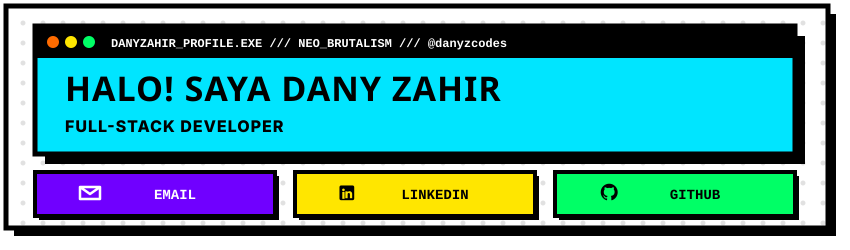
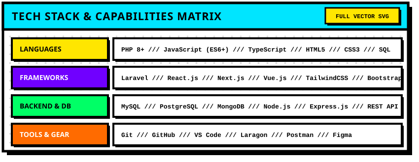
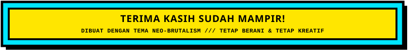

<!-- 
  =============================================================
  NEO-BRUTALISM GITHUB PROFILE README - DANY ZAHIR (@danyzcodes)
  =============================================================
-->

<!-- 1. HERO HEADER BANNER (ALL IN ONE GRAPHIC) -->

  

 

<!-- 2. ABOUT ME / SOBRE MIM -->
<table border="4" width="100%">
  <tr>
    <td bgcolor="#FFE600">
      <h2 align="center"><b>ABOUT ME / TENTANG SAYA</b></h2>
    </td>
  </tr>
 <tr> 
  <td bgcolor="#FFFFFF" style="padding: 16px;"> 
    
<i> 
      Saya seorang <b>Full-Stack Web Developer</b> yang berfokus pada pengembangan  
      <b>aplikasi web modern, scalable, dan berkinerja tinggi</b>. Saya terbiasa  
      mengembangkan sistem dari sisi <b>frontend hingga backend</b>, serta  
      mengintegrasikan berbagai teknologi seperti <b>JavaScript, TypeScript, React </b>. Saya juga tertarik pada <b>AI integration</b>, pengembangan  
      produk digital, dan eksplorasi teknologi baru. Dalam desain, saya menyukai  
      filosofi <b>Neo-Brutalism</b>—berani, kontras, dan langsung pada intinya! 
    </i>
 
  </td> 
</tr>
</table>

 

<!-- 3. TECH STACK & CAPABILITIES MATRIX -->

  

 

<!-- 4. FOOTER BANNER -->

  

